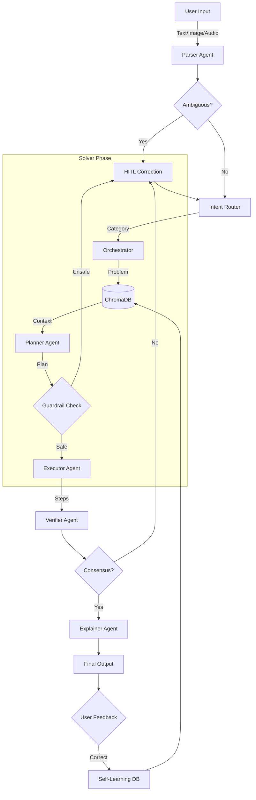

# Reliable Multimodal Math Mentor 🧮

An advanced AI-powered Math Tutor capable of solving JEE-style problems from Text, Image, and Audio inputs. Built with a robust **Multi-Agent Architecture** including RAG, HITL (Human-in-the-Loop), and Self-Learning capabilities.

## 🏗️ Architecture



## ✨ Features

- **Multimodal Input**: Upload images (OCR), record audio (ASR), or type text.
- **Robust Parsing**: Deterministic corruption checks and ambiguity detection.
- **Safety Guardrails**: Prevents "hallucinatory" algebra (degree explosion, illegal division).
- **RAG Powered**: Retrieves formulas and similar solved examples from a curated JEE knowledge base.
- **Self-Learning**: Learns from user feedback and certified solutions.
- **Strict Verification**: Verifies answers against domain constraints.

## 🚀 Setup

1. **Clone the repository**

   ```bash
   git clone <repo-url>
   cd aimath
   ```

2. **Create Virtual Environment**

   ```bash
   python -m venv venv
   # Windows
   .\venv\Scripts\activate
   # Mac/Linux
   source venv/bin/activate
   ```

3. **Install Dependencies**

   ```bash
   pip install -r requirements.txt
   ```

   *Note: You may need Pytorch installed properly for your system first.*

4. **Environment Variables**
   Copy `.env.example` to `.env` and add your Groq API Key:

   ```bash
   cp .env.example .env
   ```

   Edit `.env`:

   ```properties
   GROQ_API_KEY=gsk_...
   ```

## 🏃‍♂️ How to Run

1. **Seed the Knowledge Base** (First time only)
   Populate the RAG database with essential formulas.

   ```bash
   python -m aimath.database.seed_data
   ```

2. **Start the Application**

   ```bash
   streamlit run aimath/ui/app.py
   ```

3. **Open Browser**
   Go to `http://localhost:8501` to use the Math Mentor.

## 🛠️ Tech Stack

- **Framework**: Agno Agent Library
- **LLM**: Llama 3.3 70B (via Groq)
- **RAG**: ChromaDB
- **UI**: Streamlit
- **Tools**: EasyOCR, Faster-Whisper
